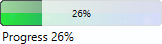
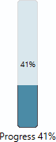

# JavaFX ImageProgressIndicator

## Custom ProgressIndicator for JavaFX

* ProgressIndicator that uses custom images as animation
* usable just like the default ProgressIndicator

## Screenshots

### custom horizontal progress bar



### custom vertical progress bar



## Requirements

* JavaFX 8

### Demo only

* Java 11
* Uses Java 9 Platform Module System (JPMS)
* Gradle

## How To

* check out repository
* gradlew run

## Usage in FXML

See src/main/resources/demo/view/MainWindowView.fxml for a full example.

```
<?import progressindicator.ImageProgressIndicator?>
<ImageProgressIndicator imageUrl="@../progressindicator/LoadingBar.png"
                                    imageSize="1"
                                    orientation="HORIZONTAL"
                                    fx:id="determinateProgressIndicator"/>
```

### Attributes

<br>`imageUrl`: relative path to the image that should be used as progress indicator. Note the @-sign at the beginning
of the string. Any image supported by JavaFX can be used. Try an animated gif :)
<br>`imageSize`: Size to scale the image, default 1
<br>`orientation`: HORIZONTAL or VERTICAL: determines the orientation of the layer that covers determinate progress bars

## Usage in Java

See JavaDoc for a full description.
<br>See src/main/java/demo/view/MainWindowView.java for a full example.

```
String imageUrl = ImageProgressIndicator.class.getResource("loadingCircle.gif").toExternalForm();
ImageProgressIndicator imageProgressIndicator = new ImageProgressIndicator(imageUrl, 1, ORIENTATION.HORIZONTAL);
```

### Parameters

<br>`imageUrl`: URL to the image that should be used as progress indicator. Any image supported by JavaFX can be used.
Try an animated gif :)
<br>`imageSize`: Size to scale the image, default 1
<br>`orientation`: HORIZONTAL or VERTICAL: determines the orientation of the layer that covers determinate progress bars

### Extra Properties

There are three additional properties to the usual Node-properties:
<br>`StringProperty textProperty()`: The Label's text below the progress indicator
<br>`BooleanProperty progressPercentVisibleProperty()`: The percentage text centered on the image, false to hide text,
true to show text
<br>`BooleanProperty overlayVisibleProperty()`: The overlay that makes a bar appear growing from left to right or bottom
to top

## Styling

See src/main/resources/progressindicator/ImageProgressIndicator.css for an example.

Four styleclasses are added for styling:
<br>`image-progress-indicator`: Styleclass of the main component.
<br>`main-layer`: Styleclass of the main layer inside the progress indicator, contains the ImageView.
<br>`overlay<`: Styleclass of the layer that covers the image during determinate progress. Set `-fx-opacity` to 0 to
hide the layer;
<br>`progress-percent`: Styleclass of the layer displaying the progress on top of the image.